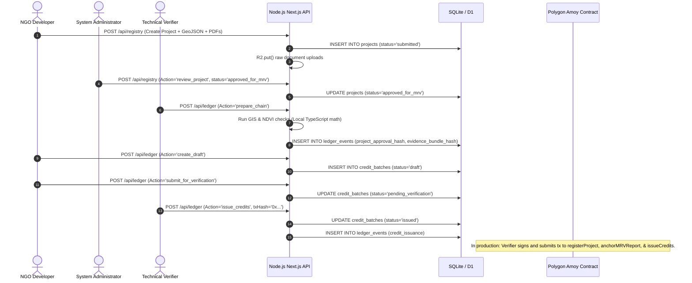
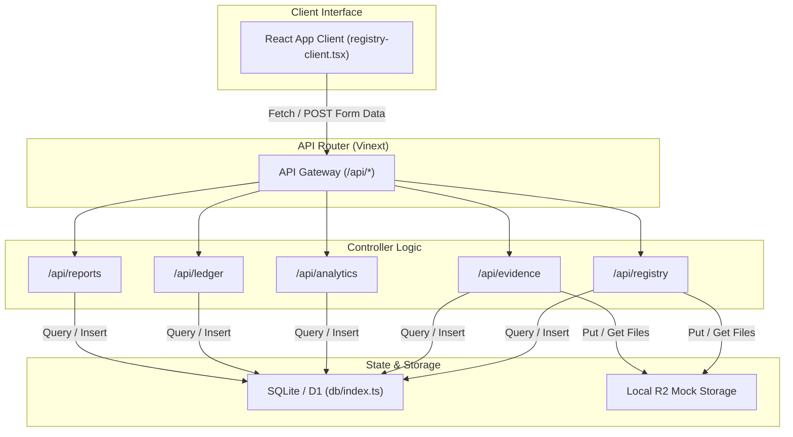

# BlueLedger: In-Depth Technical Architecture & Security Audit

This document is a deep technical audit of the **BlueLedger / BlueRegistry** codebase. It reverse-engineers the existing implementation line-by-line, exposes architectural vulnerabilities, identifies missing modules, and outlines a rigorous engineering roadmap to turn this prototype into a production-grade enterprise system.

---

## 1. Project Understanding

### 1.1 The Problem Solved
BlueLedger addresses the core issue of trust, transparency, and manual bottlenecks in the blue carbon market. Current Monitoring, Reporting, and Verification (MRV) methods are slow, expensive, and opaque. BlueLedger automates the technical MRV pipeline by integrating GIS analysis, satellite telemetry, and blockchain-based immutable event-chaining, shifting the industry from irregular manual checks to a continuous, auditable monitoring loop.

### 1.2 The Complete Intended Workflow
1. **NGO/Community Registration:** Project developers onboarding their profiles.
2. **Project Submission:** Developers upload GeoJSON boundaries, GPS coordinates, and baseline evidence files.
3. **Manual Ownership Verification (Onboarding):** Administrators manually audit land titles and government leases off-chain.
4. **Automated Verification Execution:** Upon approval, the engine checks for project boundary overlaps, coordinates bounding boxes, and calculates baseline/current vegetation indices (NDVI) via Google Earth Engine.
5. **Ledger Event Chaining:** The platform generates cryptographic SHA-256 hashes of the project approval, boundary geometry, evidence items, and verifier decisions, linking them into an append-only chain.
6. **Token Issuance:** If criteria are satisfied, carbon credits are minted as tokens on the Polygon Amoy blockchain.
7. **Credit Marketplace & Retirement:** Buyers purchase, transfer, and permanently retire tokens on-chain, generating status-aware PDF certificates.
8. **Continuous Telemetry Loop:** Satellites automatically monitor the site every 90 days, raising flags or halting token issuance if forest degradation is detected.

### 1.3 Implemented vs. Placeholder vs. Missing Functionality

* **Implemented:**
  * Node.js/TypeScript REST API routed using the Next.js App Router (but run on a custom Vite dev server with Cloudflare Workers emulation).
  * SQLite/D1 database schema creation and data seeding on-demand ([db/index.ts](file:///c:/Users/anish/Desktop/Major%20project/restored-blue-carbon/db/index.ts)).
  * In-memory, basic geometric calculations (area, overlap, ray-casting containment, and bounding-box IoU) implemented in pure TypeScript ([app/api/analytics/route.ts](file:///c:/Users/anish/Desktop/Major%20project/restored-blue-carbon/app/api/analytics/route.ts)).
  * Simulated satellite metrics generator via deterministic string-hashing algorithms (`deterministicNdvi`).
  * On-demand PDF/CSV report generation utilizing custom binary stream creation ([app/api/reports/route.ts](file:///c:/Users/anish/Desktop/Major%20project/restored-blue-carbon/app/api/reports/route.ts)).
  * Solidity smart contract mapping batch structures and status controls ([contracts/BlueLedgerRegistry.sol](file:///c:/Users/anish/Desktop/Major%20project/restored-blue-carbon/contracts/BlueLedgerRegistry.sol)).
  
* **Placeholders / Mockups:**
  * **Google Earth Engine Integration:** Simulated deterministically based on string hashes of scene IDs. No active connection to GEE or Sentinel API exists in the code.
  * **Blockchain Transaction Execution:** The backend does not connect to a JSON-RPC node to sign and broadcast transactions to Polygon Amoy. It simply accepts a user-supplied 32-byte hash (`transactionId`) and writes it to the local SQLite database.
  * **Wrangler / R2 Local Binding:** Emulated locally using filesystem storage directories; does not connect to active Cloudflare R2 Buckets in dev.

* **Completely Missing:**
  * **Authentication/JWT System:** There are no login or registration forms, JWT signing, password hashing, or token refresh logic.
  * **Redis / BullMQ Integration:** No background workers, retry queues, or cron loops are implemented in the code. Everything runs synchronously inside the Next.js HTTP API route handlers.
  * **Postgres & PostGIS Database:** The application is hardcoded to run on Cloudflare D1/SQLite. No PostGIS geospatial queries are implemented.
  * **React Native Mobile App:** No code for the mobile client is present.
  * **Carbon Marketplace Engine:** No escrow contracts, order books, listings, or payment gateways exist; credits are transferred and retired manually via form actions.

### 1.4 System Workflow Diagram



---

## 2. Architecture Reverse Engineering

The application is structured as a monolithic Next.js repository executed locally via a custom Vite server. Below is the current communication flow between modules:



### Communication Flow:
* **UI to API Gateway:** The user interacts with [registry-client.tsx](file:///c:/Users/anish/Desktop/Major%20project/restored-blue-carbon/app/registry-client.tsx) (and sub-workspaces like `analytics-workspace.tsx` or `evidence-workspace.tsx`). Actions are sent via `fetch` as `FormData` containing an `action` parameter.
* **Geospatial Processing:** When the client requests project verification, [app/api/analytics/route.ts](file:///c:/Users/anish/Desktop/Major%20project/restored-blue-carbon/app/api/analytics/route.ts) runs coordinate calculations inside the main execution thread, parsing `boundary_geojson` and looping through coordinates.
* **Report Compiling:** [app/api/reports/route.ts](file:///c:/Users/anish/Desktop/Major%20project/restored-blue-carbon/app/api/reports/route.ts) directly queries D1 for project details, formats raw strings into PDF binary objects using an in-line Helvetica character mapping, and returns a binary stream response directly to the browser.
* **Blockchain Synchronization:** The application depends on a "double-recording" design. A user executes a contract call off-line (or in MetaMask), gets a transaction hash, and manually passes it to `/api/ledger` via `issue_credits`, `transfer_credits`, or `retire_credits`. The API records this hash in the `ledger_events` table.

---

## 3. Authentication & Authorization

### 3.1 Current Implementation (Header-based Proxy)
The application contains **no internal authentication flow** (such as JWT, OAuth, or sessions). Instead, it relies on HTTP headers injected by the OpenAI reverse proxy:
* `oai-authenticated-user-email`
* `oai-authenticated-user-full-name`
* `oai-authenticated-user-full-name-encoding`

In local development, the code bypasses checks by checking `process.env.NODE_ENV !== "production"` and defaulting to a mock user profile:
```typescript
if (process.env.NODE_ENV !== "production") {
  return { email: "demo@blueregistry.local", name: "Demo User" };
}
```

### 3.2 Role-Based Access Control (RBAC)
Role management is implemented by storing a `role` string in the `users` table.
* **Enforced Roles:**
  * `admin`: Accesses all projects, reviews and approves project registrations (`review_project`), and assigns administrator/verifier roles.
  * `verifier`: Accesses approved projects, reviews monitoring evidence (`review_evidence`), and executes ledger actions (`prepare_chain`, `issue_credits`).
  * `ngo` / `community`: Restricted to projects owned by them. Can submit projects, upload evidence, and create draft carbon batches.
  * `buyer`: Reads approved projects and credit histories. Can buy, transfer, and retire carbon credits.
* **Security Concerns in RBAC:**
  * The middleware checking role authentication relies on the database profile. If a user profile does not exist, they are prompted to save one, at which point they can select *any* role (except `verifier` and `admin` if other admins exist).
  * **Critical Bypass:** If no users exist in the database, the first user to submit a profile can make themselves an `admin` (line 156-162 in `app/api/registry/route.ts`).

### 3.3 Recommended JWT-Based RBAC Architecture
For a secure deployment, implement a JWT architecture:

```
[Client] ──► 1. Login (Email/Password) ──► [Auth Service] (Verify Bcrypt Hash)
   ▲                                              │
   │ 4. Attach Access Token                       ▼ 2. Generate Tokens
   └─ (Header: Bearer JWT) ◄────────────── [Access Token (15m) + Refresh Token (7d)]
```

* **Middlewares:** Implement `authMiddleware` verifying JWT signatures and `roleMiddleware(['admin', 'verifier'])` parsing claims.
* **Database Updates:** Create `roles` and `permissions` tables with a many-to-many relationship mapping, avoiding hardcoded string lookups in routes.

---

## 4. Onboarding & Registration System

The onboarding system is currently **mocked**. There is no registration system, sign-up forms, or verification flows.

### 4.1 Recommended Registration Design
1. **User Sign Up:** Uploader submits Email, Full Name, Password, and Role (NGO or Company).
2. **Email Verification:** A one-time token is sent via SMTP. The account remains inactive until verified.
3. **NGO Profile Onboarding:** The NGO must submit corporate registration files, tax documents, and a KYC/KYB payload.
4. **Admin Approval Queue:** Administrators verify the corporate documents in the admin dashboard and change the user's `verification_status` from `unverified` to `verified`.
5. **Password Reset/Recovery:** Uses signed, short-lived reset tokens dispatched via email.

---

## 5. Database Analysis

The database is built on **Cloudflare D1 (SQLite)**. 

### 5.1 Tables & Schema Breakdown

```
  ┌────────────────┐         ┌────────────────┐         ┌────────────────┐
  │     users      │         │    projects    │         │   documents    │
  ├────────────────┤         ├────────────────┤         ├────────────────┤
  │ email (PK)     │◄───┐     │ id (PK)        │◄───┐     │ id (PK)        │
  │ role           │    │     │ owner_email    │    │     │ project_id     │
  │ org_name       │    │     │ status         │    │     │ category       │
  │ status         │    │     │ boundary_geo   │    │     │ object_key     │
  └────────────────┘    │     └────────────────┘    │     └────────────────┘
                        │                           │
  ┌────────────────┐    │     ┌────────────────┐    │     ┌────────────────┐
  │ evidence_items │    │     │ evidence_files │    │     │ credit_batches │
  ├────────────────┤    │     ├────────────────┤    │     ├────────────────┤
  │ id (PK)        │◄───┼──┐  │ id (PK)        │    │     │ id (PK)        │
  │ project_id     │────┼──┼─►│ evidence_id    │    ├────►│ project_id     │
  │ source_type    │    │  │  │ object_key     │    │     │ status         │
  │ uploader_email ├────┘  │  │ sha256         │    │     │ current_holder ├─┐
  └────────────────┘       │  └────────────────┘    │     └────────────────┘ │
                           │                        │                        │
  ┌────────────────┐       │  ┌────────────────┐    │     ┌────────────────┐ │
  │evidence_reviews│       │  │ ledger_events  │    │     │benefit_records │ │
  ├────────────────┤       │  ├────────────────┤    │     ├────────────────┤ │
  │ id (PK)        │       │  │ id (PK)        │    │     │ id (PK)        │ │
  │ evidence_id    ├───────┘  │ project_id     ├────┘     │ project_id     │ │
  │ decision       │          │ event_hash     │          │ proof_hash     │ │
  └────────────────┘          └────────────────┘          └────────────────┘ │
                                       ▲                                     │
                                       └─────────────────────────────────────┘
```

### 5.2 Database Architecture Critique
1. **Lack of Foreign Key Constraints:** SQLite does not enforce relations because table creation statements omit `FOREIGN KEY (project_id) REFERENCES projects(id)`. This can lead to orphaned document records if a project is deleted.
2. **Missing Indexes:**
   * `projects` table lacks an index on `status` combined with `id`.
   * `evidence_items` needs a composite index on `(project_id, source_type, monitoring_stage)`.
   * `evidence_files` lacks an index on `sha256`, which degrades duplicate-file performance as uploads scale.
3. **No Audit Trails:** While `ledger_events` tracks blockchain transactions, there is no internal system audit table tracking administrative updates (e.g. who updated user permissions or changed system variables).

### 5.3 Recommended Schema Improvements
Deploy a real **PostgreSQL** instance with the following tables:
* `roles` & `permissions` (Decoupled RBAC model).
* `refresh_tokens` (Stores hashed refresh tokens to enable secure session revocation).
* `audit_logs` (Stores `user_id`, `action`, `ip_address`, `timestamp` for security compliance).
* `verification_jobs` (Tracks status of remote GIS and GEE processing tasks).

---

## 6. GIS & Geoprocessing Analysis

The GIS module in [app/api/analytics/route.ts](file:///c:/Users/anish\Desktop\Major project\restored-blue-carbon\app\api\analytics\route.ts) is implemented in vanilla TypeScript instead of PostGIS.

### 6.1 Geometry Math Review
* **Area Calculation:** The `polygonAreaHectares` function projects the polygon onto a local coordinate plane by scaling longitude by the cosine of the center latitude:
  $$\text{projectedX} = \text{earthRadius} \times \text{lng} \times \text{rad} \times \cos(\text{centerLat} \times \text{rad})$$
  This is a simplified projection model. It is suitable for small, local projects, but introduces significant distortion at scale or near the poles.
* **Point-In-Polygon Check:** Implements a standard ray-casting algorithm (`pointInPolygon`) to verify whether field measurements fall within the boundary.
* **Overlap Check:** Compares all polygon segments for intersection (`segmentsIntersect`). If segments intersect, or one polygon's starting point is inside the other, it flags an overlap.

### 6.2 Missing GIS Validation & Frauds
1. **No Self-Intersection Checks:** The engine does not verify if a polygon intersects itself (forming a "figure 8"), which corrupts area calculations.
2. **GPS Spoofing:** Uploader can submit coordinates inside the boundary, but upload photos taken elsewhere.
3. **Sliver Polygons:** Does not filter out tiny overlapping margins caused by coordinate rounding errors.

### 6.3 PostGIS Transition Plan
Replace custom JS math loops with PostgreSQL + PostGIS queries:
* Store boundaries using the `geometry(Polygon, 4326)` data type.
* Detect overlap: `ST_Intersects(geomA, geomB)`.
* Calculate accurate area: `ST_Area(geom::geography) / 10000` (calculates geodesic area directly on the ellipsoid).
* Speed up searches using spatial index: `CREATE INDEX projects_spatial_idx ON projects USING GIST (boundary_geom)`.

---

## 7. Automated Verification Engine

The verification pipeline is currently simulated in Node.js.

### 7.1 Existing Mock Engine
The API computes NDVI using a deterministic algorithm:
```typescript
const ecosystemBase = ecosystem === "mangrove" ? 0.5 : ecosystem === "seagrass" ? 0.38 : 0.45;
const stageEffect = stage === "baseline" ? -0.06 : stage === "annual" ? 0.05 : 0.02;
const variation = ((hash % 81) - 40) / 1000 + Math.min(index, 6) * 0.008;
return Math.max(-1, Math.min(1, ecosystemBase + stageEffect + variation));
```
While this generates realistic values for the front-end demonstration, it is completely artificial.

### 7.2 Production Engine Architecture
To make the MRV engine functional, deploy a dedicated Python microservice:

```
[Next.js API] ──► 1. Submit Job ──► [BullMQ / Redis] ──► 2. Poll Job
                                                              │
                                                              ▼
[S3 / R2 Bucket] ◄── 4. Save NDVI TIF ◄── [Python GEE Worker] (Run NDVI extract)
```

1. **Worker Script:** A Python worker utilizes the `google-earth-engine` and `gee-raster` libraries.
2. **Sensing Source:** Sentinel-2 Level-2A imagery is queried, filtered for cloud cover ($<10\%$), and clipped to the project geometry.
3. **Vegetation Index Calculation:**
   $$\text{NDVI} = \frac{\text{Band 8 (NIR)} - \text{Band 4 (Red)}}{\text{Band 8} + \text{Band 4}}$$
4. **Water Masking:** Implements NDWI to filter out tidal waters that temporarily submerge canopy vegetation.

---

## 8. Carbon Sequestration Estimation

### 8.1 Current Calculations
The project estimates sequestration using a standard linear biomass model:
$$\text{Annual CO}_2\text{e} = \text{Area (ha)} \times \text{Biomass Factor} \times \text{Carbon Fraction} \times \frac{44}{12}$$

* **Ecosystem Factors:**
  * **Mangrove:** Biomass Factor = $12.4$ t/ha/year, Carbon Fraction = $0.47$
  * **Seagrass:** Biomass Factor = $4.2$ t/ha/year, Carbon Fraction = $0.45$
  * **Salt Marsh:** Biomass Factor = $7.1$ t/ha/year, Carbon Fraction = $0.46$

### 8.2 Limitations & Real-world Adjustments
* **Satellites Cannot Measure Soil Carbon:** Blue carbon systems store the majority of their carbon in the soil (Soil Organic Carbon - SOC), not in the above-ground biomass. Above-ground satellite telemetry alone misses $80\%$ of the project's actual carbon sequestration.
* **Lack of Aging Factor:** Sequestration is modeled as linear. In reality, young saplings sequester very little carbon; sequestration rates peak after 5-10 years and slow as the forest reaches maturity.

---

## 9. Blockchain & Smart Contract Audit

### 9.1 Network & Node Connections
The project targets the **Polygon Amoy Testnet (Chain ID 80002)**. Currently, the client web UI displays PolygonScan links for transactions, but the backend does not broadcast transactions. It is a metadata registry that records transaction hashes provided by the client.

### 9.2 Smart Contract Architecture ([BlueLedgerRegistry.sol](file:///c:/Users/anish/Desktop/Major%20project/restored-blue-carbon/contracts/BlueLedgerRegistry.sol))
The contract registers anchors, anchors MRV reports, issues, transfers, and retires credits.

#### Critical Security Vulnerabilities:
1. **Reentrancy Risk:** Although the contract does not handle ERC-20 transfers or native currency, state variables are updated *after* emitting events. While not directly exploitable in this hash registry, it violates the Checks-Effects-Interactions pattern.
2. **Missing Upgradability:** If a bug is found in the contract, it cannot be modified. A production system must use a proxy pattern (such as OpenZeppelin's `UUPS` or `TransparentProxy`).
3. **Centralization:** The contract designates an `owner` who can assign and revoke `verifier` roles at will. If the owner's key is compromised, the attacker can authorize arbitrary verifiers and mint fraudulent carbon credits.

---

## 10. Storage Layer

The storage layer relies on **Cloudflare R2** bindings (`EVIDENCE` and `DB`).

* **Off-chain Storage (R2):**
  * Raw PDF files (leases, land titles, and verification reports).
  * Field photographs and raw sensor logs.
  * Geospatial TIFF layers generated by Google Earth Engine.
* **On-chain Storage (Polygon):**
  * Crytographic hashes of the files (SHA-256).
  * Transaction and batch identifiers.
  * Token ownership balances and retirement receipts.

---

## 11. API Documentation

| Endpoint | Method | Auth | Inputs | Database Queries | Side Effects | Security Vulnerability |
| :--- | :--- | :--- | :--- | :--- | :--- | :--- |
| `/api/registry` | `GET` | Header | `documentId` (Optional) | `SELECT * FROM projects`, `SELECT * FROM documents` | None. | No access restriction if document IDs are guessed. |
| `/api/registry` | `POST`| Header | `action`, `boundaryGeojson`, `name`, `startDate`, Upload PDFs | `INSERT INTO projects`, `INSERT INTO documents` | Saves uploaded documents to R2. | File uploads do not check for malicious content types. |
| `/api/evidence` | `POST`| Header | `action`, `projectId`, `sourceType`, Upload image | `INSERT INTO evidence_items`, `INSERT INTO evidence_files` | Saves photo to R2. | GPS EXIF spoofing; files are not scanned for malware. |
| `/api/ledger` | `POST`| Header | `action`, `projectId`, `batchId`, `transactionId` | `INSERT INTO ledger_events`, `UPDATE credit_batches` | Modifies credit batch status. | Trusting client-supplied transaction hashes without RPC verification. |

---

## 12. Asynchronous Task Queue

No background worker architecture is currently implemented. 

### Recommended Queue Design:
1. **Redis Queue:** Configure a Redis instance.
2. **BullMQ Integration:** Set up three queues:
   * `gis-queue`: Handles polygon validation, overlap detection, and satellite median compositing.
   * `blockchain-queue`: Processes the database outbox and executes transactions on Polygon.
   * `alert-queue`: Runs automated 90-day telemetry checks to scan for vegetation loss.

---

## 13. Marketplace

There is **no built-in marketplace** implementation. Credits can be transferred or retired, but the transaction logic contains no pricing, billing, or settlement mechanisms.

### Recommended Escrow Design:
To enable secure peer-to-peer trading without intermediate risk, deploy a dedicated **Escrow Contract**:
1. Seller creates a listing mapping `batchId` to a `pricePerToken` in USDC.
2. Seller transfers the registry tokens to the Escrow Contract.
3. Buyer calls the `purchase` function, sending the required USDC.
4. The Escrow Contract automatically transfers the carbon tokens to the buyer and the USDC to the seller.

---

## 14. Stakeholder Dashboards

The client dashboard [stakeholder-dashboard.tsx](file:///c:/Users/anish/Desktop/Major%20project/restored-blue-carbon/app/stakeholder-dashboard.tsx) displays different screens based on the active role:
* **NGO:** Visualizes project deadlines, missing evidence types, and annual sequestration metrics.
* **Verifier:** Displays a chronological queue of submitted evidence and pending review decisions.
* **Admin:** Surfaces duplicate spatial boundaries and pending project approvals.
* **Community:** Displays benefit records, planting counts, and payments in local currencies.
* **Buyer:** Surfaces search tools and transaction links to verify retired credits.

---

## 15. Security & Vulnerability Audit

1. **SQL Injection Risks:** Next.js D1 bindings use parameterized SQL query preparation (`DB.prepare().bind()`). This mitigates SQL injection risks in the primary queries. However, constructing query strings dynamically (e.g., using template literals in search fields) must be avoided.
2. **Missing Rate Limiting:** There is no rate limiting on the API. A malicious user could flood the system with mock projects or photo uploads, filling R2 storage and crashing the database.
3. **Secrets Exposure:** Blockchain private keys must be stored in secure environment variables, never hardcoded in source control or exposed in frontend bundles.
4. **Malware Uploads:** The R2 uploader checks files based on mime-types, but does not execute binary malware scans. An attacker could upload an executable disguised as an image file.

---

## 16. Code Quality & Technical Debt

* **Code Organization:** The codebase uses Next.js App Router API routes combined with custom Vite build configurations. The layout is clean and logical.
* **High Coupling:** Business logic, geometry calculations, and database queries are tightly coupled inside the route files (e.g., [app/api/ledger/route.ts](file:///c:/Users/anish/Desktop/Major%20project/restored-blue-carbon/app/api/ledger/route.ts)). They should be refactored into decoupled Services, Repositories, and Controller layers.
* **No Unit Tests:** There are no tests in the project. Testing the spatial math and smart contracts is required before deployment.

---

## 17. Completely Missing Features List

* **Backend & Security:** Local JWT Auth, email SMTP verification, Google KMS integration, rate limiting, and uploader malware scanning.
* **GIS & Telemetry:** Active Google Earth Engine integration, water masking, and PostGIS database tables.
* **Blockchain:** Active Web3 provider / RPC integration, contract upgradability proxy, and gas fee management.
* **Marketplace:** Smart contracts for escrowed tokens, USDC/INR payment gateways, and order books.
* **UX & Operations:** Interactive onboarding wizard, real-time Slack/Email alerts, and custom certificate styling.

---

## 18. Development Roadmap

```
Phase 1: Security & Auth (3 Weeks)
├── Implement JWT Auth & Bcrypt password hashing
└── Add uploader file scanners and API rate limiting

Phase 2: PostGIS & Python GIS Engine (4 Weeks)
├── Migrate SQLite to PostgreSQL + PostGIS
└── Build Python GEE worker utilizing BullMQ/Redis

Phase 3: Web3 RPC Node Integration (3 Weeks)
├── Build Outbox blockchain worker
└── Deploy ERC-1155 smart contracts on Polygon Amoy

Phase 4: Marketplace & Polish (2 Weeks)
├── Build Escrow contract for token exchange
└── Implement real-time notifications and UI widgets
```

---

## 19. Final Architecture Review

### Mandatory Changes for Production:
1. **Migrate to PostgreSQL + PostGIS:** Absolute requirement for spatial overlap checking and geometric indexing.
2. **Implement Async Job Queues:** Prevent HTTP timeouts during satellite imagery processing and blockchain transaction submission.
3. **Decouple Backend Code:** Refactor controllers out of API route files into distinct Service and Repository layers.

### Final Assessment:
* **Scale rating:** **4/10** as a production candidate (due to mockups and lack of authentication), but a solid **8.5/10** as a final-year engineering prototype.
* **Strengths:** Clean UI execution, logical structure of the evidence ledger, and solid smart contract design.
* **Weaknesses:** Bypassed authentication, simulated remote sensing, and lack of real Web3 transaction broadcasting.
