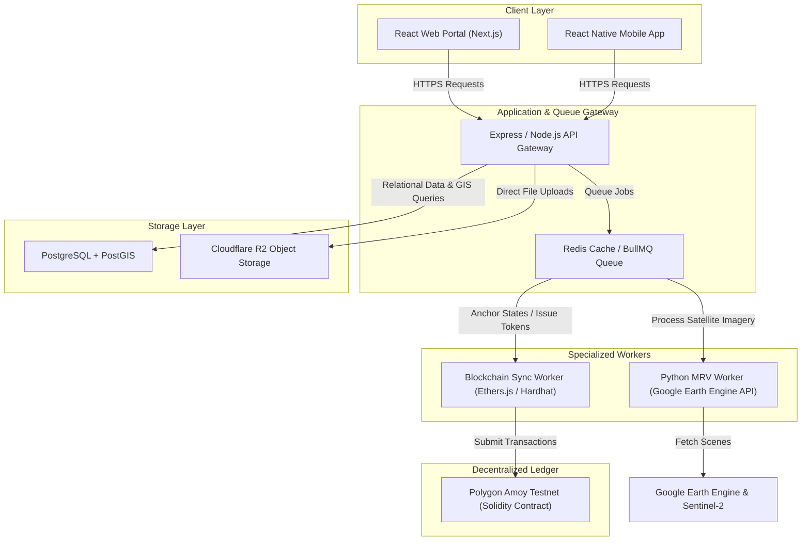

# BlueLedger: Architecture Review, Critique, and Improvement Plan (Review 1)

This document provides a comprehensive technical review, architectural critique, and practical improvement plan for the **BlueLedger** blue carbon registry and Monitoring, Reporting, and Verification (MRV) platform. 

It is structured from the perspectives of a **Senior Software Architect**, **GIS Engineer**, **Blockchain Engineer**, and **Carbon Market Expert** to guide the project from an early-stage prototype to a solid, highly resilient final-year engineering system.

---

## 1. Project Overview & Scope

### 1.1 The Core Goal
The primary objective of **BlueLedger** is to automate the technical **Monitoring, Reporting, and Verification (MRV)** pipeline for blue carbon restoration projects (mangroves, seagrasses, salt marshes) once legal authorization has been manually verified. 

> [!IMPORTANT]
> **Scope Boundary:** This platform does not legally verify land ownership or replace government registries. Legal ownership, leases, and local community authorization documents are manually validated by system administrators during the onboarding phase. Once a project is approved for MRV, the automated monitoring engine takes over.

### 1.2 The Problem Space
Traditional blue carbon credit generation faces several engineering and operational bottlenecks:
* **Manual Inspections:** Heavy reliance on physical site surveys, which are expensive, slow, and infrequent.
* **Delayed Issuance:** Verifying forest growth and carbon accumulation manually can take years.
* **Double Registration:** The risk of different developers registering overlapping boundaries for different credit programs.
* **Opacity:** Lack of public visibility into the evidence chains (field photos, satellite data, carbon formulas) supporting issued credits.
* **Centralization:** Credit retirements and transfers are logged in private databases, risking double-selling.

---

## 2. System Architecture & Tech Stack

The proposed system utilizes a decoupled, event-driven architecture designed to handle long-running geospatial computations and immutable ledger transactions.



### 2.1 Technology Stack Specification

| Component | Technology | Role |
| :--- | :--- | :--- |
| **Frontend Web** | Next.js, React, Tailwind CSS | Admin, NGO, Buyer, and Public registries. |
| **Mobile App** | React Native | Offline-first field data, GPS tracking, and geo-tagged photography for community monitors. |
| **Backend API** | Node.js, Express | Role-Based Access Control (RBAC), database routing, and job dispatching. |
| **Task Queue** | Redis, BullMQ | Asynchronous job management for heavy GIS computations and blockchain writes. |
| **Database** | PostgreSQL + PostGIS | Storing structured application state and executing spatial queries (overlap, containment). |
| **Object Storage**| Cloudflare R2 | S3-compatible, egress-free hosting for raw TIFF satellite data, PDF certificates, and field media. |
| **Geospatial Engine**| Python, Google Earth Engine (GEE), Sentinel-2 | Automating NDVI extraction, canopy classification, and surface water masks. |
| **Blockchain** | Polygon Amoy, Solidity, Ethers.js | Immutable registry events and ERC-1155 / ERC-20 token lifecycle (Issuance, Transfer, Retirement). |

---

## 3. Multidisciplinary Technical Critique

### 3.1 Software Architecture Perspective (Senior Architect)
#### Critical Flaws:
1. **Synchronous Request Bottlenecks:** Fetching satellite data directly inside API routes will trigger gateway timeouts. A web server requesting GEE API calls synchronously will hang.
2. **State Desynchronization:** If a write to PostgreSQL succeeds but the transaction on Polygon Amoy fails (e.g., due to gas spikes or network congestion), the database and the blockchain become out-of-sync.
3. **Lack of Idempotency:** If the network fails mid-transaction during a transfer or retirement, retry requests could duplicate the token movements.

#### Suggested Improvements:
* **Async Job Pattern:** API routes must immediately return a `202 Accepted` status with a job ID. The client polls the status of the job, which is processed asynchronously by the BullMQ worker.
* **Outbox Pattern:** Store blockchain actions in a `pending_blockchain_transactions` table in PostgreSQL as part of the database transaction. A separate transactional worker processes this table sequentially, ensuring that ledger writes always match local database records.

---

### 3.2 GIS & Remote Sensing Perspective (GIS Engineer)
#### Critical Flaws:
1. **NDVI Blindspots in Blue Carbon:** NDVI works well for dense land forests, but seagrass and salt marshes are frequently submerged in water. Water absorbs Near-Infrared (NIR) light, causing NDVI to drop to negative values, misinterpreting healthy submerged vegetation as degraded or dead.
2. **Cloud Cover Interference:** Coastal areas in the tropics (where mangroves thrive) suffer from persistent cloud cover during monsoon seasons. An automated 90-day check might fail or produce bad alerts if it runs on cloudy scenes.
3. **Spatial Overlap Precision:** The coordinate reference system (CRS) must be explicitly managed. Using standard GPS latitude/longitude (EPSG:4326) for area calculations introduces distortion.

#### Suggested Improvements:
* **Alternative Vegetation Indices:** Use NDWI (Normalized Difference Water Index) to mask out tidal waters, and apply NDVI only to exposed canopies. For seagrass, use the **Deformation Index** or bathymetric corrections.
* **Temporal Compositing:** Instead of using a single satellite scene every 90 days, construct a **cloud-free composite** using median values over a 30-day window centered on the target date.
* **Metric-Based Projections:** Store spatial polygons in EPSG:4326 for global interoperability, but transform geometries to a local **UTM (Universal Transverse Mercator) zone** inside PostGIS before calculating area (`ST_Area(geom::geography)`).

---

### 3.3 Blockchain Engineering Perspective (Blockchain Engineer)
#### Critical Flaws:
1. **Centralized Key Management:** If the verifier's private key is stored in plain text in backend environment variables, a server breach compromises the entire registry.
2. **Gas Optimization:** Writing granular monitoring data to the blockchain is cost-prohibitive. Saving entire GeoJSON files or evidence objects directly on-chain will exhaust gas limits.
3. **Smart Contract Rigidness:** Hardcoding carbon estimation formulas in Solidity contracts makes it impossible to update methodologies as scientific models improve.

#### Suggested Improvements:
* **State Pinning (IPFS / Hash Anchors):** Upload raw GIS polygons and verification reports to Cloudflare R2 or IPFS, calculate the SHA-256 hash, and store only the IPFS URI / hash on-chain.
* **KMS integration:** For the final-year project, simulate or integrate a Cloud Key Management Service (like AWS KMS or Google KMS) to sign transactions securely without exposing raw private keys to the application container.
* **ERC-1155 Token Standard:** Represent carbon credits using ERC-1155. Each project and monitoring period (vintage) is represented by a unique token ID (`tokenId`). This allows batch transfers and retirement operations in a single transaction, reducing gas by up to 70%.

---

### 3.4 Carbon Market Perspective (Carbon Market Expert)
#### Critical Flaws:
1. **Lack of Additionality Proof:** A project cannot simply claim credit for existing forests. The system must prove that the carbon sequestration is *additional* (i.e., would not have occurred without the restoration project).
2. **Ignoring Soil Organic Carbon (SOC):** In blue carbon ecosystems, up to 80-90% of the carbon is stored in the soil, not the visible tree canopy. Satellites can only see above-ground biomass (AGB).
3. **Double Counting across Registries:** What prevents an NGO from registering the same project on BlueLedger and also submitting it to Verra or Gold Standard?

#### Suggested Improvements:
* **Historical Baseline Window:** Require the satellite monitoring engine to establish a 5-to-10-year historical baseline of the site before the project start date.
* **Soil Carbon Calibration:** Integrate soil core sample data points (uploaded via the mobile app by field workers) with satellite biomass calculations. The carbon model should be:
  $$\text{Total Sequestration} = \text{Above Ground Biomass (Satellite-derived)} + \text{Soil Organic Carbon (Field-calibrated)}$$
* **Registry Coexistence Checks:** Include fields for external Registry IDs (Verra, GS) and build an admin workflow to verify that the project is not actively registered elsewhere.

---

## 4. Analysis of Unrealistic Assumptions & Vulnerabilities

| Vulnerability / Assumption | Risk Level | Description | Mitigation Strategy |
| :--- | :--- | :--- | :--- |
| **GPS Spoofing in Field Photos** | **High** | NGOs or community members could upload photos taken elsewhere using modified metadata. | Use mobile camera APIs that lock coordinates at the time of capture, and implement verification of EXIF timestamps against satellite passes. |
| **Over-reliance on Automated NDVI** | **Medium** | Sudden algae blooms or seasonal floating vegetation could be misclassified as mangrove restoration. | Implement water masks using Sentinel-2 Band 8 and Band 11 to filter out non-forest vegetation. |
| **Infinite Token Issuance** | **Medium** | Bug in the smart contract allowing an NGO to mint more tokens than the physical land capacity. | Implement strict contract limits: `issuedTokens <= areaHectares * maxAnnualSequestrationFactor`. |
| **Oracle Reliability** | **High** | The system trusts the backend API to report satellite data truthfully to the blockchain (The Oracle Problem). | Require the verification worker to output a signed JSON payload that the smart contract verifies cryptographically. |

---

## 5. Actionable Improvements (For Final-Year Feasibility)

To make this project highly solid, implement these five specific upgrades during development:

### 1. Spatial Geometry Sanitization Pipeline
Do not trust client-side GeoJSON. Implement backend validation in the Node.js API using PostGIS:
```sql
-- Ensure polygon is valid and check for overlaps with approved projects
SELECT id, name 
FROM projects 
WHERE ST_Intersects(boundary_geojson::geography, ST_GeomFromGeoJSON(:newBoundary));
```
* **Action:** Before saving, run `ST_IsValid` and `ST_MakeValid` to clean up self-intersecting loops in the coordinates drawn by the NGO.

### 2. Multi-spectral Temporal Compositing (Python Engine)
Replace simple one-day satellite scenes with a seasonal composite:
```python
# Conceptual Earth Engine python script for Cloud-free Median Composite
import ee
ee.Initialize()

def get_clean_ndvi(geometry, start_date, end_date):
    collection = (ee.ImageCollection('COPERNICUS/S2_SR_HARMONIZED')
                  .filterBounds(geometry)
                  .filterDate(start_date, end_date)
                  .filter(ee.Filter.lt('CLOUDY_PIXEL_PERCENTAGE', 15)))
    
    # Calculate median value across the time window to eliminate temporary clouds
    composite = collection.median()
    ndvi = composite.normalizedDifference(['B8', 'B4']).rename('NDVI')
    return ndvi
```

### 3. Implement the Outbox Pattern for Blockchain Anchors
Avoid direct contract calls inside the primary express route handler.
```
[Express Controller] 
       │
       ▼ (Atomic Transaction)
[PostgreSQL Database] ──► Writes Application Data
                      ──► Writes Job to 'blockchain_outbox'
                                │
                                ▼ (Polling / Event)
                         [BullMQ Worker]
                                │
                                ▼ (Retry-Safe)
                     [Polygon Amoy Blockchain]
```

### 4. Upgrade Smart Contract to ERC-1155
In your Solidity directory, implement an ERC-1155 multi-token contract. This represents both fungible units (carbon tonnes) and non-fungible classifications (vintages/projects).
```solidity
// SPDX-License-Identifier: MIT
pragma solidity ^0.8.24;

import "@openzeppelin/contracts/token/ERC1155/ERC1155.sol";
import "@openzeppelin/contracts/access/Ownable.sol";

contract BlueLedgerRegistry is ERC1155, Ownable {
    // Project ID => Period (Vintage) => Total Minted
    mapping(uint256 => mapping(uint256 => uint256)) public projectVintages;
    mapping(uint256 => string) public projectMetadataURIs;

    constructor() ERC1155("") Ownable(msg.sender) {}

    function mintCredits(
        address to, 
        uint256 projectId, 
        uint256 vintage, 
        uint256 amount,
        string memory reportURI
    ) external onlyOwner {
        uint256 tokenId = uint256(keccak256(abi.encodePacked(projectId, vintage)));
        projectVintages[projectId][vintage] += amount;
        _mint(to, tokenId, amount, "");
    }
    
    function retireCredits(
        address holder,
        uint256 projectId,
        uint256 vintage,
        uint256 amount
    ) external {
        uint256 tokenId = uint256(keccak256(abi.encodePacked(projectId, vintage)));
        _burn(holder, tokenId, amount);
        // Emits a public, unalterable retirement log
        emit CreditsRetired(holder, projectId, vintage, amount);
    }

    event CreditsRetired(address indexed holder, uint256 indexed projectId, uint256 indexed vintage, uint256 amount);
}
```

### 5. Automated Alerting & Grace Periods
If the 90-day satellite cron job detects a vegetation drop below a specific baseline threshold:
1. Trigger a warning event on-chain (`emit ProjectAlert(projectId, "NDVI_DROP_DETECTED")`).
2. Do not immediately delete the project. Put it in a **90-day grace period**.
3. Create a ticket in the NGO dashboard asking them to upload field evidence or explain the discrepancy (e.g., seasonal shedding vs. illegal logging).
4. If no satisfactory evidence is verified within 90 days, suspend future token minting.

---

## 6. Architecture Comparison

| Feature | Baseline Prototype | Recommended Architecture |
| :--- | :--- | :--- |
| **API Architecture** | Synchronous REST requests | Asynchronous task queues + Job polling |
| **Conflict Resolution** | Basic overlap checks in JS | Robust spatial indexing using PostGIS |
| **Token Standard** | Standard ERC-20 / custom logs | ERC-1155 (Multi-token for Projects/Vintages) |
| **Telemetry Analysis** | Simple NDVI comparison | Cloud-free temporal compositing + Water masks |
| **Fault Tolerance** | Direct writes (risk of desync) | Outbox Pattern with automatic worker retries |
| **Carbon Metric** | Generic Above-Ground biomass | Combined Above-Ground + Soil Carbon points |

---

## 7. Conclusion
By decoupling the heavy remote sensing and blockchain operations from the user-facing web API, and introducing spatial validation through PostGIS, **BlueLedger** moves from a simple prototype to a resilient, production-ready enterprise model. This architecture guarantees data integrity, prevents fraudulent double-registration, and offers maximum transparency to carbon buyers.
