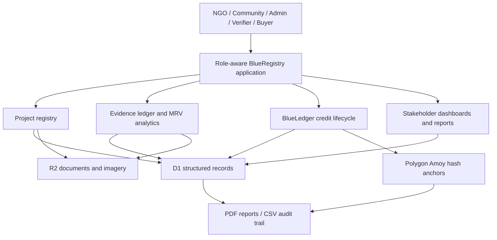
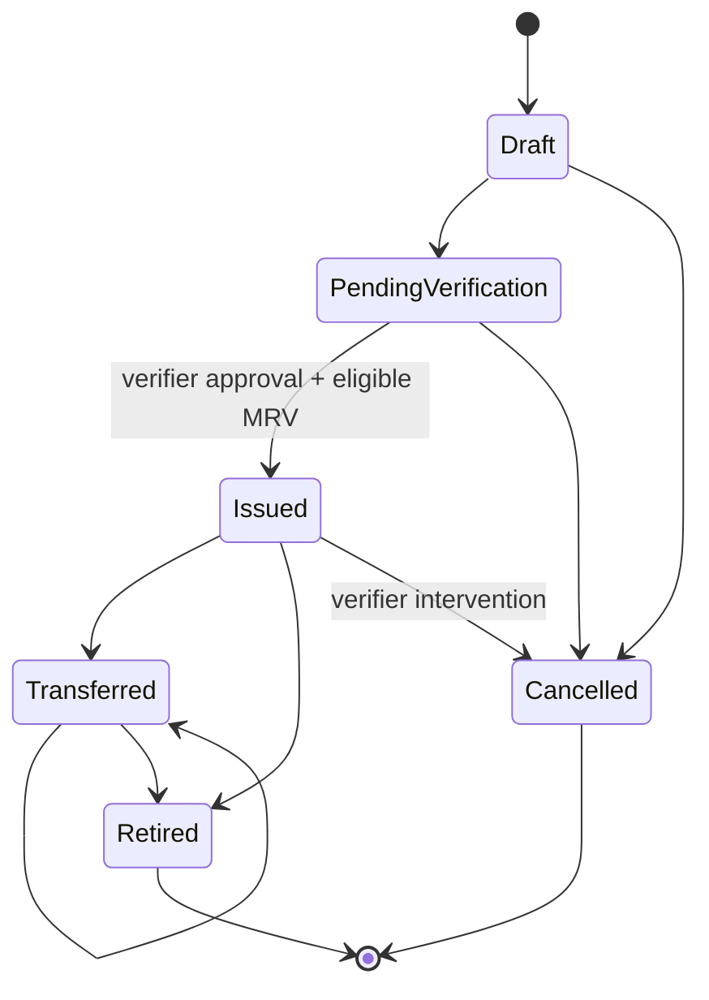

# BlueRegistry / BlueLedger — Project Analysis

## 1. Executive summary

BlueRegistry is an end-to-end blue-carbon project registry and monitoring, reporting and verification (MRV) platform designed for mangrove, seagrass and salt-marsh restoration projects. It creates a traceable path from project registration and authorization evidence through field monitoring, technical verification, carbon estimation, credit issuance, transfer and retirement.

The system addresses a practical trust gap: coastal restoration projects often accumulate documents, field photographs, sensor exports, satellite scenes and carbon spreadsheets in separate places. That fragmentation makes it difficult for communities, project developers, technical verifiers, administrators and buyers to understand whether a carbon claim is supported by complete and consistent evidence.

BlueRegistry does not claim that software can automatically establish land ownership, validate every carbon claim or replace professional judgment. Instead, it:

1. records structured evidence and its provenance;
2. applies transparent automated checks that generate flags rather than final decisions;
3. preserves qualified human approval steps;
4. computes estimates from visible assumptions;
5. creates an append-only, hash-linked event history; and
6. prepares verified lifecycle events for anchoring on Polygon Amoy.

The result is a prototype that judges can test across five stakeholder roles using one pre-seeded project journey.

## 2. Problem definition

### 2.1 Operational problems

Blue-carbon programmes commonly face:

- inconsistent project-registration formats;
- unclear links between community authorization and the registered boundary;
- duplicate or overlapping project claims;
- evidence stored as unstructured files with weak provenance;
- field observations that cannot be reconciled with project coordinates;
- satellite and carbon results that are presented without assumptions;
- credit records that are difficult to trace back to their monitoring period;
- poor visibility for coastal communities after evidence is submitted; and
- buyer-facing registries that show a credit quantity without its supporting chain.

### 2.2 Trust problems

Three categories of trust must remain separate:

- **Legal and administrative trust:** whether submitted authorization evidence is sufficient for the registry’s admission policy.
- **Technical trust:** whether monitoring evidence, spatial consistency, calculations and uncertainty support the MRV result.
- **Registry trust:** whether credit issuance and retirement events are unique, ordered and tamper-evident.

BlueRegistry models these as separate workflows. An administrator approving a project for MRV does not assert legal title. A technical verifier approving evidence does not automatically deploy a blockchain transaction. A testnet transaction does not convert a prototype estimate into an accredited market instrument.

## 3. Stakeholders and permissions

### NGO / project developer

The NGO registers projects, supplies responsible-organization details, draws the restoration boundary, uploads authorization and restoration documents, submits monitoring evidence and responds to verifier comments.

The Phase 5 dashboard emphasizes:

- project status;
- missing source types;
- next monitoring deadline;
- annual sequestration estimate;
- current evidence count; and
- latest verifier feedback.

### Coastal community representative

The community role uses a simplified, mobile-first dashboard. It highlights restoration work instead of technical registry terminology:

- saplings recorded;
- observed survival percentage;
- approved credit quantity;
- restoration progress; and
- benefit or funding entries, including beneficiary, description, amount and proof hash.

### Administrator

The administrator controls registry admission and system integrity. The dashboard surfaces:

- organizations awaiting verification;
- projects awaiting documentary review;
- possible boundary overlaps;
- unreviewed evidence; and
- consolidated risk alerts.

Only a qualified administrator can move a submitted project through the approval workflow. The product deliberately describes this as authorization-evidence review, not automatic ownership verification.

### Technical verifier

The verifier sees:

- chronological evidence;
- individual review decisions and comments;
- satellite baseline/current comparison;
- NDVI change;
- carbon factors and uncertainty;
- evidence completeness and location checks;
- prepared ledger hashes; and
- blockchain anchoring status.

Verifier decisions are explicit actions: approve, reject or request clarification. The system never silently converts an AI quality score into approval.

### Buyer / observer

The buyer/public registry view is designed around independent inspection:

- search approved projects;
- filter credit status;
- inspect vintage, quantity and holder;
- view the MRV report hash and registry event hash;
- follow a Polygon Amoy transaction;
- distinguish issued from retired credits; and
- download a current-status or retirement certificate.

## 4. End-to-end architecture

### Application layer

The application is implemented with Next-compatible React components through Vinext and produces Cloudflare Worker-compatible output. API handlers enforce server-side role checks. UI controls are convenience affordances, not the security boundary.

### Structured storage

D1 stores:

- user and organization profiles;
- projects and approval status;
- review-event history;
- evidence item metadata;
- evidence review decisions;
- credit batches;
- append-only ledger events; and
- transparent community-benefit records.

### Object storage

R2 stores large files such as:

- authorization documents;
- restoration plans;
- baseline material;
- field photographs;
- drone imagery; and
- other uploaded evidence.

Only file metadata and SHA-256 fingerprints are stored in the structured evidence ledger.

### Blockchain layer

The Solidity contract is designed for Polygon Amoy, chain ID `80002`. It stores hashes and identifiers, not large evidence.

The principal functions are:

- `registerProject`;
- `anchorMRVReport`;
- `issueCredits`;
- `transferCredits`; and
- `retireCredits`.

The application remains honest about deployment status. Prepared hashes are not described as on-chain until a valid transaction identifier is attached.

## 5. Data and workflow model

### Project admission

1. A project developer creates an organization profile.
2. The developer registers the project and ecosystem.
3. Location details and planned duration are recorded.
4. A polygon is drawn and persisted as GeoJSON.
5. The client calculates area in hectares; the server retains the geometry.
6. Authorization, restoration-plan and baseline evidence are uploaded.
7. An administrator reviews the submission.
8. The project becomes approved for MRV, is rejected, or receives a change request.

### Monitoring and evidence

Evidence items use a common envelope:

- project ID;
- monitoring stage;
- monitoring period;
- observation time;
- uploader;
- source type; and
- source-specific structured values.

Supported sources include field, sensor, drone and satellite evidence. Files are immutable: new submissions create new evidence records and never overwrite historic files.

### Technical analysis

The prototype evaluates:

- boundary overlap;
- duplicate or similar locations;
- whether field GPS observations fall inside the approved polygon;
- evidence completeness;
- sensor availability;
- satellite freshness;
- NDVI baseline/current change;
- possible degradation;
- file-quality indicators; and
- verifier decision state.

### Carbon estimation

The transparent prototype equation is:

`approved area × ecosystem biomass factor × carbon fraction × 44/12`

For the seeded mangrove project:

- approved area: 154.8 hectares;
- biomass factor: 12.4 tonnes biomass per hectare per year;
- carbon fraction: 0.47; and
- carbon-to-CO₂ conversion: 44/12.

The resulting value is an estimate, not an accredited issuance amount. The interface exposes an uncertainty range and warns that production use requires locally validated factors and an accepted methodology.

### Credit lifecycle

Core controls include:

- no issuance before verifier approval;
- no duplicate batch for a project and monitoring period;
- no issuance when an approved-area overlap remains;
- quantity cannot exceed the prototype annual estimate;
- only the current holder or an authorized verifier can initiate relevant actions;
- retired credits cannot be transferred;
- each event includes its previous event hash; and
- transaction identifiers must be 32-byte, `0x`-prefixed hashes.

## 6. Demo dataset

The local demo identity is `demo@blueregistry.local`. Its default role is NGO and can be switched from the dashboard.

The principal project is **Sundarban Mangrove Recovery Corridor**:

- ecosystem: mangrove;
- location: Gosaba, South 24 Parganas, West Bengal;
- approved area: 154.8 hectares;
- community partner: Gosaba Gram Sabha;
- status: approved for MRV;
- field record: 12,400 saplings and 86% observed survival;
- satellite comparison: baseline NDVI 0.31, current NDVI 0.58;
- issued batch: 1,280 tCO₂e;
- retired batch: 940 tCO₂e; and
- community benefit entries: INR 1,850,000 restoration grant and INR 620,000 worker payments.

A second proposal, **Matla Creek Mangrove Proposal**, deliberately overlaps the approved boundary. It remains in document review and gives the administrator a realistic risk alert.

## 7. Reporting

The reporting API generates current-data downloads:

### Technical MRV PDF

Contains:

- project and approved boundary summary;
- monitoring evidence count;
- verifier approvals;
- carbon formula and assumptions;
- uncertainty;
- issued-credit quantity;
- latest proof hashes and transaction;
- community benefit entries; and
- limitations.

### Carbon-credit PDF certificate

Contains:

- certificate and batch IDs;
- project and monitoring period;
- vintage and quantity;
- current status;
- holder or retiring entity;
- MRV report hash;
- registry event hash;
- Polygon Amoy transaction;
- retirement timestamp; and
- a warning when the batch is not retired.

### Audit-trail CSV

Exports every registry event with:

- timestamp;
- project ID;
- event type;
- event hash;
- previous event hash;
- payload hash;
- transaction ID; and
- actor.

## 8. Security and integrity considerations

### Implemented

- server-side role checks;
- authenticated-user header support;
- prepared SQL statements;
- content-type and size validation for uploads;
- R2-backed file storage;
- SHA-256 file and payload hashes;
- immutable evidence-item creation;
- append-only ledger-event creation;
- unique project/period constraint for batches;
- explicit lifecycle transition validation; and
- no document payloads on-chain.

### Required before production

- formal smart-contract audit;
- multi-signature or hardware-backed verifier key governance;
- recovery and rotation policy;
- formal database backup and retention policy;
- malware scanning and image metadata privacy review;
- rate limiting and abuse detection;
- accessibility and localization testing with coastal communities;
- independent carbon-methodology validation;
- data-protection impact assessment; and
- incident response and dispute-resolution procedures.

## 9. Responsible AI

AI-assisted features are advisory. The design principles are:

1. **No autonomous project approval.** Authorization evidence is reviewed by a qualified administrator.
2. **No autonomous verifier decision.** Quality scores and flags prioritize review but do not approve evidence.
3. **Visible assumptions.** Carbon factors, data freshness and uncertainty remain inspectable.
4. **Traceable inputs.** An estimate links to evidence records, review decisions and source files.
5. **Visible unresolved issues.** Reports retain open flags rather than hiding them behind a combined score.
6. **Contestability.** Project developers can receive clarification requests and submit additional evidence without overwriting the original record.
7. **Proportionate claims.** Testnet proofs demonstrate integrity mechanics and are not presented as accredited credits.

## 10. SIH evaluation value

BlueRegistry demonstrates more than a dashboard mock-up. Judges can:

- switch among five user roles;
- inspect an approved project and an intentionally risky proposal;
- follow evidence through technical analysis;
- inspect verification comments;
- view a transparent carbon calculation;
- observe the credit state machine;
- inspect testnet transaction links;
- verify retirement status;
- view community funding records; and
- download machine- and human-readable outputs.

The prototype’s strongest contribution is its separation of concerns: evidence capture, qualified decisions, transparent calculations and tamper-evident registry events work together without exaggerating what automation or blockchain can prove.

